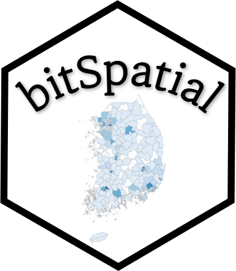

```{r setup, include=FALSE}
knitr::opts_chunk$set(echo = TRUE, 
                      message = FALSE, 
                      warning = FALSE, 
                      collapse = FALSE,
                      fig.align = "center")
knitr::opts_chunk$set(fig.width = 12, fig.height = 9)

library(shiny)
library(htmltools)

xaringanExtra :: use_panelset()
```

```{r tidyverse, echo=FALSE, out.width = "25%"}

```

```{r, preface, echo=FALSE}
div(class = "preface", 
    h4("들어가기"),
    "지도 위에 통계를 표현하고 싶다구요?", br(),
    "이제 여러분은 행정구역 경계 수치지도 기반으로 공공데이터를 집계하고, 이를 시각화할 수 있습니다.")
```

<br>

TO-DO